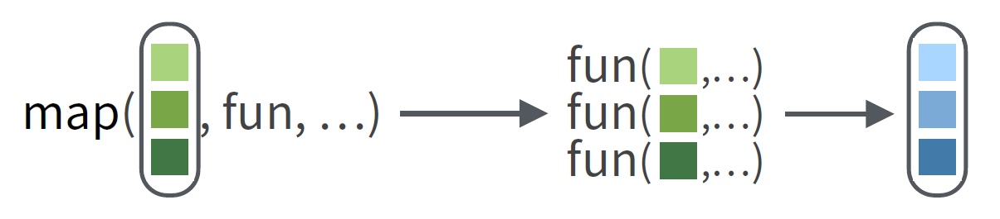
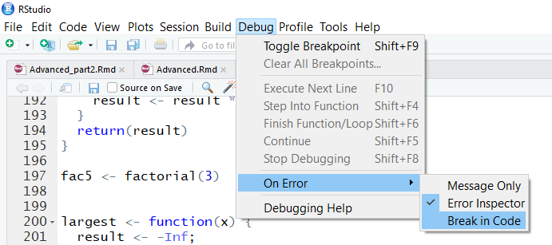
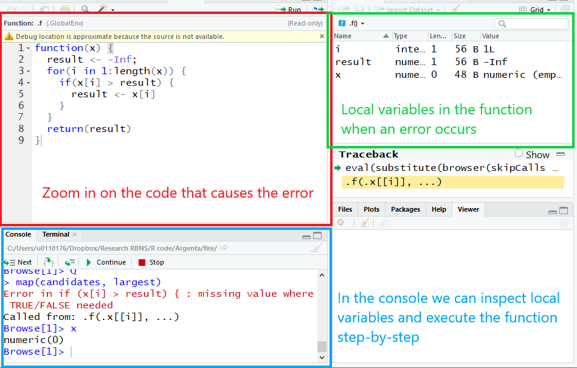
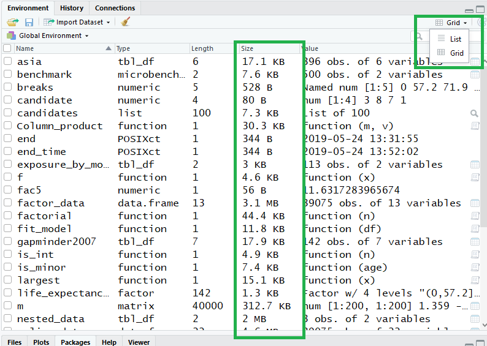

```{r setup, include=FALSE}
options(htmltools.dir.version = FALSE)
```

.title[
  Practical information
]

Course material including

- R scripts, data, lecture sheets 

- a collection of **cheat sheets** 

are available from

<br>

<center>
<font size="5">
<a href="https://github.com/katrienantonio/workshop-R"target="_blank">https://github.com/katrienantonio/workshop-R</a>
</font>
</center>

---

.title[
  Learning outcomes
]

Today you will work on:

- Data structures 
  - Data sets (<span style="color:#e0144e;">dplyr</span>)
  - Factor variables 
  - Date management (<span style="color:#e0144e;">lubridate</span>)

- Functional programming (<span style="color:#e0144e;">purrr</span>)

- Efficient programming
  - Debugging
  - Benchmarking
  - RProject

You will cover examples of code and work on **R challenges**.

---
.title[
Follow-up R basics workshop
]

Today we provide an answer to the questions raised during the **R basics** workshop.

* What about garbage collection in R?

* Why do some variables already exist when I start a new session in RStudio?

* Can RStudio automatically load packages at startup?

* How can I debug my code?

* What is the difference between `%Y` and `%y` in formatting date objects?

---

.title[
  Setup
]

.vspaceM[

]

.code[
We continue exploring the `tidyverse`. 

Don't forget to load this package.
```{r, message=FALSE, warning=FALSE}
#install.packages("tidyverse")
require(tidyverse)
```
]

---

.title[
Tidyverse
]

The tidyverse is a collection of R packages sharing the same design philosphy.


`require(tidyverse)` loads the 8 core packages:

<div class="left-column3">

&bull; <span style="color:#e0144e;">ggplot2</span> <br>
&bull; <span style="color:#e0144e;">dplyr</span> <br>
&bull; <span style="color:#e0144e;">tidyr</span>
</div>

<div class="center-column3">
&bull; <span>readr</span> <br>
&bull; <span style="color:#e0144e;">purrr</span> <br>
&bull; <span style="color:#e0144e;">tibble</span> 

</div>

<div class="right-column3">
&bull; stringr <br>
&bull; forcats
</div>

`install.package("tidyverse")` installs many other packages, including:

<div class="left-column3">

&bull; <span style="color:#e0144e;">lubridate</span>
</div>

<div class="center-column3">

&bull; readxl 

</div>

Today you will use <span style="color:#e0144e;">6 packages</span> from the tidyverse!

---

.title[
Tidyverse
]

The tidyverse structures the full workflow of a data analyst.

<center>

</center>

---
class: inverse, center, middle

# Programming style

---

.title[
R style guide
]

Deciding on a programming style provides consistency to your code and assists in reading and writing code. 

The choice of style guide is unimportant, but it is important to choose a style! 

This workshop follows a set of rules roughly based on the [tidyverse style guide](https://style.tidyverse.org/).

---

.title[
R style guide
]

Variable names contain only **lower case** letters. If the name consists of multiple words, then these words are separated by **underscores**. 

```{r tidy=FALSE, eval=FALSE}
number_of_simulations <- 100
```

--

User defined functions follow the same convention as variable names, but start with a capital letter.
```{r tidy=FALSE, eval=FALSE}
Multiply_by_2 <- function(x) {
  return(x * 2)
} 
```

--

Functions from external packages usually start with a lowercase letter.
```{r tidy=FALSE, eval=FALSE}
zero_list <- rep(0, 100)
```


---

class: inverse, center, middle

# Data sets

---
.title[
The policy data set
]


- `PolicyData.csv` available in the course material.

- Policy covariates from a motor insurance portfolio.

- Data stored in a `.csv` file. 

- Individual records separated by a `semicolon`.

--

Extract the directory of the current active file in Rstudio. <br>  Requires installation of the package `rstudioapi`. 
```{r, eval = FALSE}
dir <- dirname(rstudioapi::getActiveDocumentContext()$path)
setwd(dir)
```` 

--

Read and store the data
```{r}
policy_data <- read.csv(file = '../data/PolicyData.csv', sep = ';')
```

---

.title[
R challenge
]

Use the skills you obtained in the **R basics** workshop.

1. Inspect the top rows of the data set.

1. How many observations does the data set contain?

3. Calculate the total exposure (`exposition`) in each region (`type_territoire`). 

---

```{r, eval = FALSE}
head(policy_data)
```

```{r, echo = FALSE}
head(policy_data[, c('numeropol', 'debut_pol', 'fin_pol', 'freq_paiement', 'langue')])
```

```{r}
nrow(policy_data)

policy_data %>% 
  group_by(type_territoire) %>%
  summarise(exposure = sum(exposition))
```
---

.title[
The gapminder package
]

.vspaceS[

]

- Data available in the package `gapminder`.

- Describes the evolution of a number of population characteristics (GDP, life expectancy, ...) over time.

.code[
```{r, message=FALSE, warning=FALSE}
#install.packages("gapminder")
require(gapminder)
```
]

---

.title[
R challenge
]

Use the skills obtained in the **R basics workshop** to:

1. Inspect the top rows of the data.

2. Select the data for countries in Asia.

3. Which type of variable is `country`?

---

.vspaceM[

]

```{r}
head(gapminder)
```


```{r}
asia <-  filter(gapminder, continent == "Asia")
```


```{r}
class(gapminder$country)
```

---
class: inverse

background-image: url("Images/Title/wrangling.PNG")
background-size: 50%

.titlecenter[
  <span style='color:#FFF'>Data structures</span>
]
---
background-image: url("Images/Title/factor.jpg")
background-size: cover

.titlecenter[
  Factor variables
]

---

.title[
What is a factor variable?
]

.vspaceS[

]


+ Representation for categorical data.

+ Predefined list of outcomes (levels).

+ Protecting data quality.


---

.title[
factor()
]

.vspaceS[

]

.code[
`sex` is a categorical variable with two possible outcomes `m` and `f`.
```{r}
sex <- factor(c('m', 'f', 'm', 'f'),
              levels = c('m', 'f')) #<<
```
The `factor` command creates a new factor variable. 

The first input is the categorical variable.
]

---

.title[
factor()
]

.vspaceS[

]

.code[
`sex` is a categorical variable with two possible outcomes `m` and `f`.
```{r}
sex <- factor(c('m', 'f', 'm', 'f'), #<<
              levels = c('m', 'f')) 
```
`levels` specifies the possible outcomes of the variable.
]

---

.title[
factor()
]

Assigning an unrecognized level to a factor variable results in a warning.

```{r}
sex[1] <- 'male'
```

This protects the quality of the data!

```{r}
sex
```

```{r, include = FALSE}
sex <- factor(c('m', 'f', 'm', 'f'), #<<
              levels = c('m', 'f'))
```


The value `NA` is assigned to the invalid observation.
---

.title[
levels()
]

.vspaceM[

]

.code[
```{r}
  levels(sex)
```
  `levels` prints the allowed outcomes for a factor variable.
]

---

.title[
levels()
]

.vspaceM[

]

.code[
```{r}
  levels(sex) <- c('male', 'female')
  sex
```
  Assigning a vector to `levels()` renames the allowed outcomes. 
]
---

.title[
R challenge
]

The variable `country` in the `gapminder` data set is a factor variable.

1. What are the possible levels for `country` in the subset `asia`.

2. Is this the result you expected?
---

.vspaceM[

]

```{r, R.options=list(max.print=20)}
levels(asia$country)
```

<br>

`asia$country` allows the same outcomes as `gapminder$country`. 

This includes many countries outside of Asia.

---

.title[
droplevels()
]

.vspaceM[

]

.code[
```{r}
asia$country <- droplevels(asia$country)
```
  `droplevels` removes all outcomes which do not appear in the factor variable.
]

---

.vspaceS[

]

```{r}
levels(asia$country)
```

---
.title[
  Add level
]

.vspaceM[

]

.code[
```{r}
levels(sex) <- c(levels(sex), 'x')
```
Adds `x` as a new allowed outcome for the variable `sex`. 
]

---
.title[
  cut()
]

.vspaceM[

]

.code[
```{r, eval = FALSE}
cut(gapminder$pop,
    breaks = c(0, 10^7, 5*10^7, 10^8, Inf)) #<<
```
`cut()` bins a numeric variable into a factor variable. 

We bin the number of inhabitans in a country (`gapminder$pop`).
]

---
.title[
  cut()
]

.vspaceM[

]

.code[
```{r, eval = FALSE}
cut(gapminder$pop, #<<
    breaks = c(0, 10^7, 5*10^7, 10^8, Inf)) 
```
`breaks` specifies the cutoff values.
]

---

.title[
R challenge
]

Bin the life expectancy in 2007 in a factor variable.

1. Select the observations for year 2007.

2. Bin the life expectancy in four bins of roughly equal size (hint: `quantile`).

3. How many observations are there in each bin?
---

.vspaceM[

]


```{r}
gapminder2007 <- filter(gapminder, year == 2007)
breaks <- c(0, quantile(gapminder2007$lifeExp, c(0.25, 0.5, 0.75)), Inf)
breaks                   
gapminder2007 <- gapminder2007 %>% 
  mutate(life_expectancy_binned = cut(gapminder2007$lifeExp, breaks))

gapminder2007 %>%
  group_by(life_expectancy_binned) %>%
  summarise(frequency = n())
```

---

.title[
  geom_bar()
]

```{r, fig.height = 3, fig.align='center'}
ggplot(gapminder2007) + #<<
  geom_bar(aes(life_expectancy_binned))
```

`geom_bar` takes a factor variable and creates a bar plot.

---

.title[
  geom_bar()
]

```{r, fig.height = 3, fig.align='center'}
ggplot(gapminder2007) + #<<
  geom_bar(aes(life_expectancy_binned, #<<
               fill = continent))
```

`fill = continent` selects a different fill color for each continent. 

---

.title[
  geom_bar()
]

```{r, fig.height = 3, fig.align='center'}
ggplot(gapminder2007) + #<<
  geom_bar(aes(life_expectancy_binned, #<<
               fill = continent), #<<
           position = position_dodge())
```

`position = position_dodge()` shows the bars side-by-side instead of stacked.

---

.title[
  geom_bar()
]

```{r, fig.height = 3, fig.align='center'}
ggplot(gapminder2007) + #<<
  geom_bar(aes(life_expectancy_binned, #<<
               fill = continent, #<<
               y = ..prop.., group = continent), 
           position = position_dodge()) #<<
```

`y = ..prop..` and `group = continent` plot the proportion within each group instead of the absolute count.

---

background-image: url("Images/Title/time.jpg")
background-size: cover

.titlecenter[
  <span style='color:#FFF'>Date management</span>
]

---

.title[
Efficient handling of dates
]

.vspaceS[

]

You will learn to:

* store dates in the `Date` format in R

* convert text and numerical variables into a `Date` object

* perform basic calculations with dates

* start with base R and continue with lubridate.

---

.title[
  as.Date()
]

.vspaceM[

]

.code[
```{r, eval = FALSE}
as.Date('2019-06-05', 
        format = '%Y-%m-%d) #<<
```
`as.Date` converts text into an R `Date` object. 

First input is a vector of dates in text format.
]

---

.title[
  as.Date()
]

.code[
```{r, eval = FALSE}
as.Date('2019-06-05', #<<
        format = '%Y-%m-%d) 
```
The `format` describes the structure of the input. <br>
* `%Y`: Year, 4 digit notation
* `%m`: Month number
* `%d`: Day of the month.
]

For a full list of formating options, see
```{r, eval = FALSE}
?strptime
```

---

.title[
  as.Date()
]

.vspaceM[

]

.code[

```{r, eval = FALSE}
as.Date(21705, origin = '1960-01-01')
```
Dates are often stored as integers.

Convert integers to dates by speciying the origin (Day 0). 

For example: SAS stores dates at the number of days elapsed since 1 Jan 1960. 
]

---

.title[
R challenge
]

Work with the `policy_data` data set.

1. Convert the start date (`debut_pol`) and end date (`fin_pol`) into R `Date` objects.
---

.vspaceS[

]

```{r}
policy_data$start <- as.Date(policy_data$debut_pol, '%d/%m/%Y')
policy_data$end <- as.Date(policy_data$fin_pol, '%d/%m/%Y')
```

```{r}
head(policy_data %>% select(c('debut_pol', 'start')))
```
```{r}
class(policy_data$start)
```

---

.title[
  format()
]

.vspaceS[

]

.code[
```{r}
today <- as.Date('2019-06-05', #<<
                format = '%Y-%m-%d') #<<
format(today, '%A %d %B %Y')
```
`format` converts a date into text <br>
* `%A`: full weekday name <br>
* `%B`: full month name
]

---
.title[
  Adding and subtracting dates
]

Calculate the duration of a contract.
.code[
```{r, eval = FALSE}
policy_duration = 
  policy_data$end - policy_data$start
```
Subtracting dates calculates the number of days elapsed between these dates.

```{r}
tomorrow = today + 1
print(tomorrow)
```
You can add and subtract integers from dates.
]

---
.title[
  Lubridate
]

For more advanced `Date` manipulations use the `lubridate` package.
.code[
```{r, message=FALSE, warning=FALSE}
# install.packages("lubridate")
require(lubridate)
```
]

```{r, echo = FALSE, out.width = "20%", fig.align='center'}
knitr::include_graphics("Images/title/lubridate.png") 
```

---

.title[
Access date components
]

.vspaceM[

]

```{r}
year(today)
```
`year()` selects the calendar year component from the date.

Other components are: `month()`, `day()`, `quarter()`, ...

---

.title[
Advanced date math
]

.vspaceM[

]

.code[

```{r}
today + months(3)
```
`+ months(3)` adds three months to the Date object.

Other periods are: `years()` and `days()`.
]

---

.title[
Advanced date math
]

.vspaceM[

]

.code[

```{r}
floor_date(today, unit = "month")
```
`floor_date` rounds down to the nearest unit. 

In the example convert daily into monhtly data.
]

---

.title[
seq()
]

.vspaceS[

]

.code[

```{r}
seq(from = as.Date('2019-01-01'), 
    to = as.Date('2019-12-31'), 
    by = '1 month')
```
Generate a sequence of dates, useful in loops.
]

---

.title[
R challenge
]

Visualize the exposure contribution by start month of the contract in the `policy_data` data set.

1. Add a covariate `start_month` to the data set.

2. Group the data by `start_month`.

3. Calculate the exposure within each group.

4. Plot the data.


---
```{r, fig.height = 5, fig.align='center'}
exposure_by_month <- policy_data %>%
  mutate(start_month = floor_date(policy_data$start, unit = 'month')) %>%
  group_by(start_month) %>% 
  summarize(exposure = sum(exposition))
  
ggplot(exposure_by_month) +
  geom_point(aes(start_month, exposure))
```

---
class: inverse

background-image: url("Images/Title/purrr.png")
background-size: 50%

.titlecenter[
  <span style='color:#FFF'>Functional programming</span>
]

---

.title[
  What is a functional?
]

A functional is a function which takes a function as input. 

Example: the integral operator 

$$ \int_0^{1}: C([0, 1]) \to \mathbb{R}, f \mapsto \int_0^{1} f(x) \, dx,$$
where $C([0, 1])$ is the set of continuous functions on $[0, 1]$.

```{r}
f <- function(x){
  x^2
}
integrate(f, lower = 0, upper = 1)
```

---

.title[
  Why functional programming?
]

This approach offers:

* an intuitive alternative for loops.
  
* code that is easy to read and interpret

**Example**: 

Is there a policyholder who is a minor in the data set becomes:
```{r, eval = FALSE}
some(policy_data$age, Is_minor)
```

* Easily modifiable and reusable code.

* No need to copy/paste the same code many times. 

* If you use something twice, put it in a function.


---

.title[
  purrr
]

.vspaceM[

]

.code[
`purrr` is the tidyverse package for functional programming.

```{r, message = FALSE, warning = FALSE}
# install.packages("purrr"")
require(purrr)
```

]

---

.title[
map()
]


.caption[
Illustration from the [purrr cheat sheet](https://github.com/rstudio/cheatsheets/blob/master/purrr.pdf)
]


.code[

```{r, eval = FALSE}
map(policy_data, class)
```

Apply the function `class` to each column of the data set `policy_data`.
]

---

.title[
map()
]

```{r, R.options=list(max.print=4)}
map(policy_data, class)
```

The output of `map` is stored in a `list`.

---

.title[
map_chr()
]

.code[

```{r, R.options=list(max.print=3)}
map_chr(policy_data, class)
```
If the output should be of class `character`, use `map_chr`. <br>
* Additional type check when applying the function.

* Returns a vector instead of a list.

Other `map` output types: <br>
* `map_int` for integers <br>
* `map_dbl` for doubles
]

---

.title[
keep()
]

.vspaceM[

]

.code[
```{r}
factor_data <- keep(policy_data, 
                    is.factor)
```
Keeps the columns of `policy_data` for which the function `is.factor` returns `TRUE`.  
]

---

.title[
discard()
]

.vspaceM[

]

.code[
```{r}
non_factor_data <- discard(policy_data, 
                           is.factor)
```

Discards the columns of `policy_data` for which the function `is.factor` returns `TRUE`.  
]

---


.title[
every()
]

.vspaceM[

]

.code[
```{r}
every(policy_data$cout1, is.na)
```

Returns `TRUE` if and only if `is.na` returns TRUE for all observations in `policy_data$cout1`.  
]

---


.title[
some()
]

.vspaceM[

]

.code[
```{r}
some(policy_data$cout1, is.na)
```

Returns `TRUE` if `policy_data$cout1` contains an observation for which `is.na` returns TRUE.
]

---

.title[
User-defined functions
]

.vspaceS[

]

.code[
```{r}
Is_minor <- function(age) {
  return(age < 18)
}
some(policy_data$age, Is_minor)
```

Unlock the true potential of the purrr functionals by applying them to user-defined functions.
]

---

.title[
R challenge
]

- Discard all columns containing `NA` observations from the `policy_data` data set.

---

.vspaceM[

]

```{r, eval = FALSE}
Some_na <- function(x) {
  some(x, is.na)
}

policy_data_cleaned <- policy_data %>%
       discard(Some_na)

```

You can abbreviate this code as

```{r, eval = FALSE}
policy_data_cleaned <- policy_data %>%
    discard(~ some(.x, is.na))
```

Here `~[code]` is an abbreviation for `function(.x){[code]}`. <br>
You can use this for simple functions with a single input.

---

.title[
nest()
]

.vspaceM[

]

.code[
```{r, eval = FALSE}
policy_data %>%  #<<
  group_by(utilisation) %>% #<<
  nest()
```

`nest()` splits the data set into smaller sub sets based on the `group_by` category
]

---
.title[
nest()
]

```{r}
nested_data <- policy_data %>% 
  group_by(utilisation) %>% 
  nest()

print(nested_data)
```

`nested_data` contains three sub data sets. One for each type of vehicle use.

---

.title[
R challenge
]

We investigate the variable `utilisation` (vehicle use) in the policy data set.

1. Remove observations without claim cost (`cout` = 0)

2. Group the data by `utilisation`. 

3. Calculate the number of observations and average severity for each group.

---

.vspaceM[

]

```{r}
policy_data %>% 
  filter(cout > 0) %>%
  group_by(utilisation) %>%
  summarise(avg = mean(cout), count = n())
```

`summarise` is useful for computing basic statistics for individual variables from the data set.

---
.title[
R challenge
]

We want to investigate the claim cost of young drivers (age < 30). Specifically we want to see whether the cost depends on the use of the vehicle.

We will verify this by:
* Fitting a linear regression model 
$$\text{cout} \sim  \text{young_driver}$$
on subsets of the data split by vehicle use.

* Comparing the fitted parameter for the young driver effect.

---
.title[
R challenge
]

Add a variable for young drivers and split the data by `utilisation`.
```{r}
nested_data <- policy_data %>% 
  mutate(young_driver = age < 30) %>%
  filter(cout > 0) %>%
  group_by(utilisation) %>%
  nest()
```

Create a function for fitting our linear model.
```{r}
Fit_model <- function(df) {
  lm(cout ~ young_driver, data = df)
}
```

---

.title[
R challenge
]

Fit the linear model on each subset of the data using `map`.
```{r}
result <- nested_data %>%
  mutate(model = map(data, Fit_model))
```

Select the young driver effect from the model.
```{r}
Select_coef <- function(fit){
  coefficients(fit)["young_driverTRUE"]
}

result <- result %>% 
  mutate(effect_young_driver = map_dbl(model, Select_coef))
```

---

.title[
R challenge
]

```{r}
result %>% select(utilisation, effect_young_driver)
```

The advantages of having used functionals:
* easily modifiable code: what do you have to change in order to explore the interaction between young_drivers and terrain?

* no loops

* readable, intuitive code.

---

background-image: url("Images/Title/debug.jpg")
background-size: cover

.titlecenter[
  <span style='color:#FFF'>Debugging</span> 
]

---

.title[
Send the right message
]

R provides four methods for giving feedback: 

* print

* message

* warning

* stop

---

.title[
Factorial
]


Here is a function to calculate $n! = n \cdot (n-1) \cdot \ldots 1$

```{r}
Factorial <- function(n) { 
  result <- 1 
  for(i in 1:n) { 
    result <- result * i 
  } 
  return(result) 
} #<<

fac5 <- Factorial(5)
```

Let's add some messages to this function!

---

.title[
print()
]

```{r}
Factorial <- function(n) { #<<
  result <- 1 #<<
  for(i in 1:n) { #<<
    result <- result * i #<<
  } #<<
  return(result) #<<
} #<<

fac5 <- Factorial(5) #<<
print(fac5)
```

Use `print()` when you want to display the value of a variable in the console.

---

.title[
message()
]

```{r}
Factorial <- function(n) { 
  result <- 1 
  for(i in 1:n) { 
    result <- result * i
    message("step ", i, " from ", n, " -- result: ", result)
  } 
  return(result) 
} 

fac3 <- Factorial(3) 
```

Use `message()` for diagnostic information, such as runtime and intermediary results.

---

.title[
Debugging Factorial()
]

What could go wrong when calling `Factorial(n)`?

* `n` might be non-integer, for example: 1.2 

A function for checking whether n is an integer:
```{r}
Is_int <- function(n) {
  return(n == round(n))
}
```


* `n` can be negative, for example: -5

* `n` can be non-numeric, for example: "5", `c(3, 5)`.


---

.title[
warning()
]

```{r}
Factorial <- function(n) {
  if(!Is_int(n)){
    warning("non-integer value (n = ", n, ") in Factorial(). Calculating gamma(n+1).")
    return(gamma(n+1))
  }
  result <- 1 
  for(i in 1:n) { 
    result <- result * i 
  } 
  return(result) 
} 

fac3.5 <- Factorial(3.5) 
```

Use `warning()` for suspicious, but non critical events. 

---

.title[
stop()
]

```{r, eval = FALSE}
Factorial <- function(n) {
  if(!is.numeric(n) || n < 0){
    stop('Argument "n" in Factorial() must be a positive number.')
  }
  result <- 1 
  for(i in 1:n) { 
    result <- result * i 
  } 
  return(result) 
} 

fac5 <- Factorial("5") 
```
```{r, echo = FALSE}
cat('Error in Factorial("5") : 
  Argument "n" in Factorial() must be a positive number.')
```

Use `stop()` for critical events that demand an immediate interruption of the code.

---

.title[
What message to send?
]

.vspaceS[

]

* You fit a regression model $y \sim x_1 + x_2$, but the input covariates $x_1$, $x_2$ are colinear.

--

```{r, eval = FALSE}
warning("Colinearity detected in the regression variables.")
```

--

* You use an iterative algorithm to fit parameters of a model. You want to display the optimal parameters after each iteration.

--

```{r, eval = FALSE}
message("iteration ", i, ": ", param)
```

---

.title[
What message to send?
]

* You have a function with inputs $\mu$ and $\sigma > 0$. <br>
The input for $\sigma$ is negative.

--

```{r, eval = FALSE}
stop("Positive value required for sigma parameter.")
```

--

* You fitted a model and want to inspect the fitted coeficients

--

```{r, eval = FALSE}
print(coefficients(fit))
```
or
```{r, eval = FALSE}
coefficients(fit)
```

---

.title[
  Spotting bugs
]

Finding an error is often harder than solving the error.

The function below computes the largest element in a vector `x`.
```{r}
Largest <- function(x) {
  result <- -Inf
  for(i in 1:length(x)) {
    if(x[i] > result) {
      result <- x[i]
    }
  }
  return(result)
}
```

---

.title[
  Spotting bugs
]

We generate a set of test inputs
```{r}
set.seed(31415) # For reproducibility

candidates <- rpois(100, lambda = 2) %>%
  map(runif)
head(candidates, 2)
```


We have an error? Why?
```{r, eval = FALSE}
map(candidates, Largest)
```
```{r, echo = FALSE}
cat("Error in if (x[i] > result) { : missing value where TRUE/FALSE needed")
```

---

.title[
  Spotting bugs
]

**In RStudio**: Debug > On Error > Break in Code.


---

.title[
  Spotting bugs
]

The error inspector opens when an error `stop()` occurs:

```{r, echo = FALSE, out.width = "85%", fig.align='center'}
 
```

---

.title[
  Spotting bugs
]

When `length(x)` is zero, the for loop iterates over `c(1, 0)`.

```{r}
Largest <- function(x) {
  result <- -Inf
  for(i in 1:length(x)) {
    if(x[i] > result) {
      result <- x[i]
    }
  }
  return(result)
}
```

Advice: replace `1:length(x)` by `seq_along(x)` in for loops.

```{r}
print(seq_along(c()))
```

---

.title[
  browser()
]
.vspaceS[

]
.code[
```{r, eval = FALSE}
f <- function() {
  ...
  browser()
  ...
}
```
The error inspector opens when `browser()` is reached. <br>
No error message required!
]

---

background-image: url("Images/Title/benchmark.jpg")
background-size: cover

.title[
  <span style='color:#FFF'>Benchmarking</span> 
]

---
.title[
Sys.time()
]

.vspaceS[

]

.code[
```{r}
start_time <- Sys.time()
x <- runif(10^7)
end_time <- Sys.time()
end_time - start_time
```
Use `Sys.time()` to measure the elapsed time between two steps of the program and detect efficiency bottlenecks.
]

---
.title[
microbenchmark
]

.vspaceS[

]

.code[
* `microbenchmark` profiles the computation time of code. 

* Determine the most efficient implementation, when runtime is important.

```{r, message=FALSE, warning=FALSE}
#install.packages("microbenchmark")
require(microbenchmark)
```
]

---
.title[
  R challenge
]

We implement a function called `Column_product`, which multiplies the $i$-th column of a matrix `m` by the $i$-th element in a `v`. <br>

$$\texttt{Column_product}(m = \begin{bmatrix}1 & 2\\3 & 4\end{bmatrix}, v = \begin{bmatrix}2\\4\end{bmatrix}) = \begin{bmatrix}2 & 8\\6 & 16\end{bmatrix}$$

.vspaceS[

]

Create your own implementation of `Column_product()`.


---

Intuitive solution (for-loop):
```{r}
Column_product <- function(m, v){
  for(j in 1:ncol(m)) {
    m[, j] <- m[, j] * v[j]
  }
  return(m)
}
```

Other solutions:
```{r, eval = FALSE}
m %*% diag(v)
```
```{r, eval = FALSE}
t(v * t(m))
```
```{r, eval = FALSE}
m * rep(v, each = nrow(m))
```
```{r, eval = FALSE}
m * rep(v, rep(nrow(m), length(v)))
```
---

.title[
  microbenchmark()
]

.vspaceS[

]

.code[
```{r, eval = FALSE}
microbenchmark(code1,
               code2,
               ...)
```
]
Compares the efficiency of the different code chuncks (`code1`, `code2`, ...) provided.


---
.title[
  microbenchmark()
]

```{r, fig.height = 3.5, fig.align='center', message = FALSE}
m <- matrix(rnorm(200*200), nrow = 200)
v <- runif(200)
benchmark <- microbenchmark(Column_product(m, v),
               t(v * t(m)),
               m %*% diag(v),
               m * rep(v, each = nrow(m)),
               m * rep(v, rep(nrow(m), length(v))))
autoplot(benchmark)
```

---
.title[
  Memory usage
]
Choose Grid as the display method in the variable pane to view important properties (including size) of the local variables. 

<center>



</center>

---

.titlecenter[
  Rproject 
]

<center>

</center>

---

.title[
  Rproject
]

RStudio projects allow to organize your programming code. <br>

An RProject file manages:

* working directory

* R history (.Rhistory)

* Startup code (.Rprofile)

* Startup data (.RData)

Rprojects improve collaboration and reproducibility, as these elements will be identical for all users.

Create a new Rproject by clicking: <span style='font-weight:bold'>File > New project...</span>


---

.title[
  .Rprofile
]

At startup, R sources <span style='font-weight:bold'>.Rprofile</span> in the working directory of a project.

* Load packages required in the project.
```{r, eval = FALSE}
require(ggplot2)
```

* Specify a company wide plotting styles.
```{r, eval = FALSE}
company_green <- "#87D37C"

plot_style <- theme_bw() +
	theme(plot.title = element_text(size = 20,
	                                hjust = 0.5))

```

* Source custom functions required for the project.
```{r, eval = FALSE}
source(functions.R)
```

---

.title[
More resources
]

[R for Data Science](https://r4ds.had.co.nz/) focuses on using the tidyverse for consistent R programming.

[Mastering Software Development in R](https://leanpub.com/msdr) explains many common R functions through intuitive examples.

[Advanced R](https://adv-r.hadley.nz/) helps you to master the R languague.
<br>
<center>
<div>
 &nbsp; &nbsp; &nbsp; &nbsp;
 &nbsp; &nbsp; &nbsp; &nbsp;

</div>
</center>

---

class: center, middle

# Thanks!

Slides created via the R package [**xaringan**](https://github.com/yihui/xaringan).

```{r, eval=FALSE, include=FALSE}
# this code can be used to extract the R code from an R Markdown (Rmd) document
library(knitr)
purl("advanced.Rmd")
```